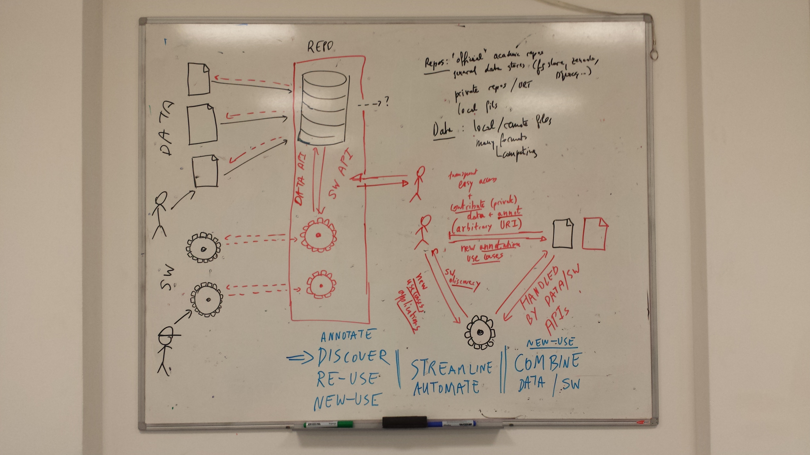

Making data and software discoverable to facilitate interoperability
========

This project aims at developing infrastructure to support considerable
challenges of modern data-driven science, the reliance on open digital
information infrastructure using automation and standardisation as
primary force to enable broader and more open scientific
dissemination, impact and creativity.

Modern science relies on ever increasing quantities of data (some have
coined it the data deluge) and on trustworthy and sustainable software
to analyse and interpret them. Each of these pillars of modern
scientific activities are generally developed and maintained
independently. On one hand, a typical data pipeline starts with a data
producer submitting these annotated data to an official repository
that, after some basic curation, passively serves it to the wider
community. This flow is unidirectional and restricted to published (or
soon to be published) data and, once part of the official repository,
becomes inert (updates and further annotations are very rare) and,
most often, dormant. On the other hand, the exposure of a research
software is often limited by the application (or applicability) to a
limited set of known of data sets, and hence limited to the original
team or sub-community. Surprisingly, while each data/software
information and development streams can't be conceived in isolation,
and their true potential emerges from their interoperation, little
effort exist to facilitate easy interactions. The ideal infrastructure
would enable transparent integration of different data source (local
or remote, public or private), data sets (transparent to file formats)
through data APIs and software architectures (local or remote) through
software APIs/pipelines. Other than re-use of data and software and
potential for automation, the major potention is discoverability of
data and software leading to new applications and use cases (from data
and software perspectives) and contributing these back as novel
data/software annotation.

Example illustrating the difficulty of cross talking between software
and data domains: existence of multiple file formats, annotation and
data provenance, which considerably hinder a systematic exploitation
of data for any or multiple software for expert users (i.e. requires
then to design infrastruture 

The aim of this project is to design and develop an infrastructure
that would serve the scientist communities with data- and
software-as-a-service infrastructures that support transparent cross
talk between data and software.

- Data and software annotation and interoperation
- Data and software discoverability
- Data and software collaborations
- reusability, uniformity to support community involvement

*Build a dynamic and executable network of interlinked software and data.*

Building up from 'bare-bone' open source software (some of which I
have developed over the years and maintain) up to transparent on-line
infrastructure, that would be adequate for collaborations with
industry (I have some contacts) and/or commercialisation.

In a nutshell (and open to discission), I would like to expand the
existing infrastructure for the analysis of high-throughput biology
data (using proteomics and integration of proteomics and genomics as a
use case)

Use case: high-throughput biology.

What about taverna? galaxi? AnnotationHub? We want to make use of
this. 
